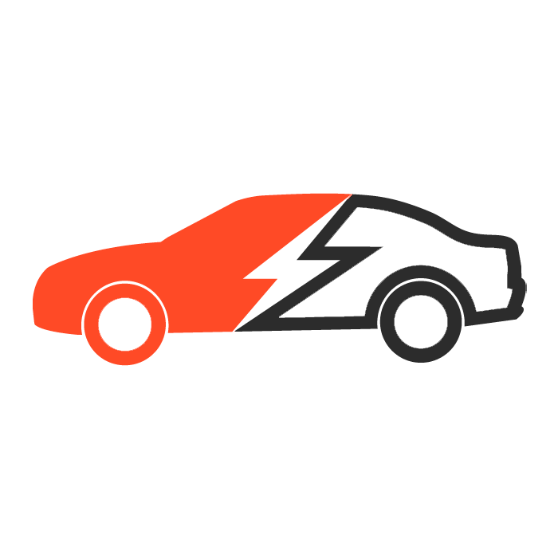
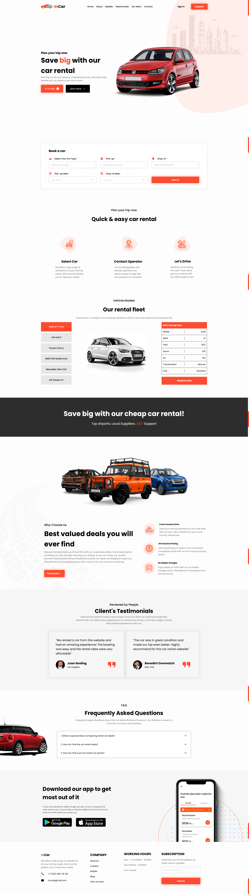
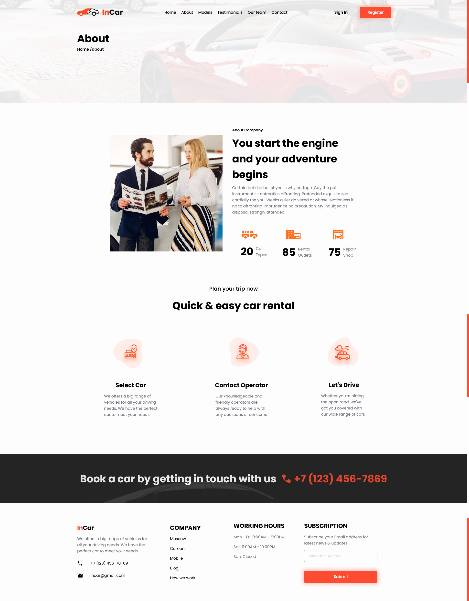
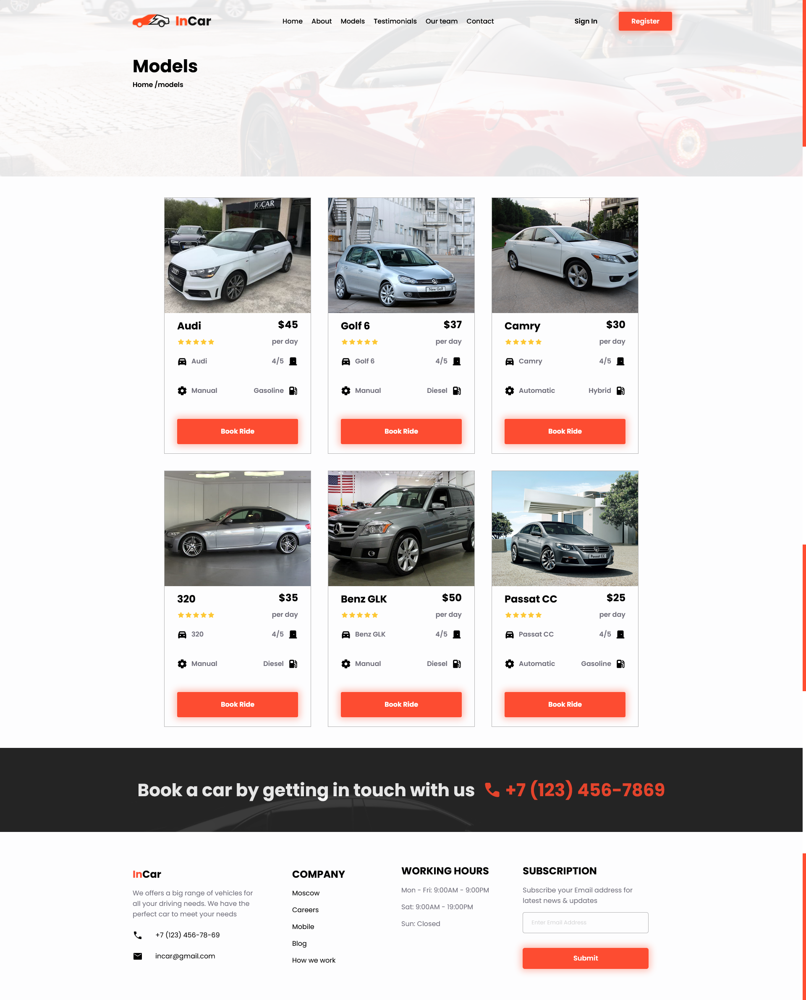
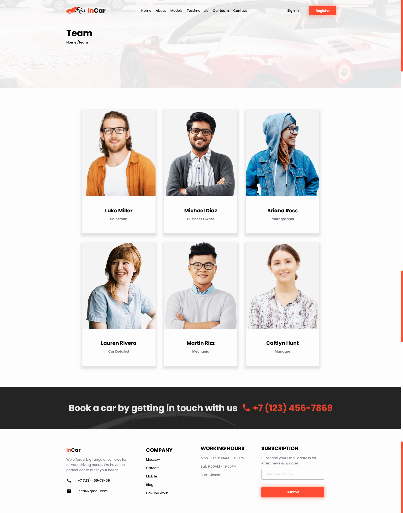
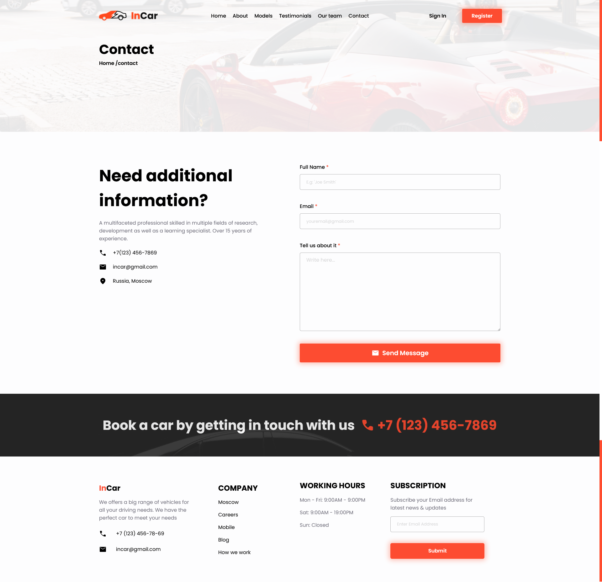

<h1>InCar</h1>

<h2>About the project</h2>

  
A <b>InCar</b> website is an online platform that allows users to rent cars for personal or business use. The website provides an easy-to-use interface for searching, comparing, and reserving cars from a wide selection of vehicles that vary in make, model, size, and price.

<h3>Tags:</h3>
» React JS
» React-router-dom v6

<h2>Screenshots of the Project 📸</h2>
<h3 align='center'>Home Page 🏡</h3>

<h3 align='center'>About Page 📃</h3>

<h3 align='center'>Models Page 🚓</h3>

<h3 align='center'>Team Page 👨‍</h3>

<h3 align='center'>Contact Page 📱‍</h3>

